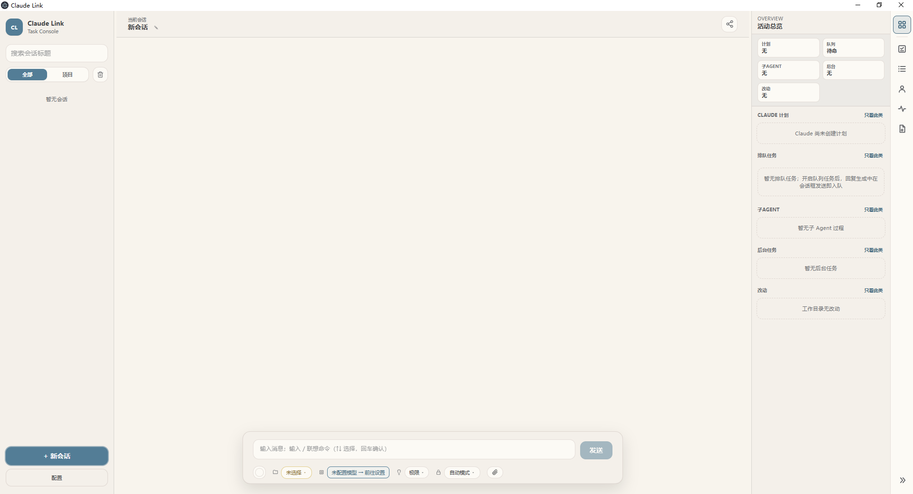
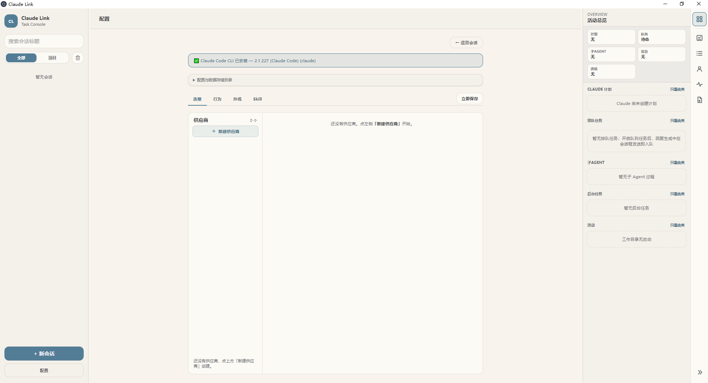

# Claude Link

Claude Link 是一个基于 Electron 的 Claude Code 桌面客户端。它调用本机安装的 Claude Code CLI，通过 Claude Agent SDK 建立会话，把模型输出、工具调用、权限交互和任务状态展示在桌面界面中。

Claude Link 不直接实现一套聊天模型，也不把用户输入原样转发到某个 HTTP 接口。每条用户消息都会由 Claude Agent SDK 创建或恢复一次 Claude Code query，配置、工作目录、权限模式和会话状态都会进入这条原生链路。所有聊天 prompt 统一经流式输入（AsyncIterable）包装发送。

## 界面预览

**主界面**——会话视图、输入工具栏与右侧活动总览：



**配置页**——供应商库、行为、外观、Skill、IM 与关于：



> 截图摄于较早版本（配置页尚未包含 IM/关于 tab），当前界面以实际应用为准。

## 主要功能

- **Claude Code 会话**：使用本机 Claude Code CLI，支持连续会话、会话恢复和中断（中断按钮长按 1 秒防误触，Esc 急停兜底）；新会话采用「暂态草稿」模式——点「新会话」不立即落库，首条消息发送时才物化为数据库记录，草稿跨视图保活。首条消息发送后自动概括 ≤20 字会话标题（思考模型防泄漏，失败回退首句前 15 字），手动改名永不被覆盖。
- **多供应商与模型库**：在设置页维护多个供应商及其模型（模型列表支持从端点查询或手动添加），每个模型可一键行内测试连接；会话工具栏单独选择当前供应商和实际模型；模型与思考强度选择器在生成中不禁用，改动「下一条消息起生效」，思考强度还展示「上回合实际生效」值（从引擎 JSONL 读取真值）。
- **配置投影**：配置同时通过进程环境变量和 SDK 内联 settings 注入 Claude Code，工作目录的 `.claude/settings.local.json` 按需投影（原子写入、内容不变跳过、不投影端点凭据）。
- **上下文占用**：顶栏圆环实时展示上下文已用占比——回合内 SDK 控制通道轮询采样（节流+变化门限），回合末以官方 `claude -p /context` 探针校准；容量分母优先取用户按别名配置的窗口覆盖，其次引擎上报窗口，缺省 200k。长按圆环 1 秒发送原生 `/compact` 压缩，压缩后弹出账单横幅（压缩前后 token 数）；刷新连续超时自动熔断退避。
- **流式输出**：展示正文、思考摘要（展开态内滚动跟随）、工具调用、工具结果、子 Agent 活动分栏、回合计时浮岛（四态阶段徽章）与回复耗时；回合结束时刻落库，重启后仍随浮岛展示。
- **统一交互弹窗**：权限确认、AskUserQuestion、文本/表单输入和本地确认共用同一交互队列，支持 7 种交互形态；启动时恢复未决弹窗。
- **Slash Commands**：读取 Claude Code SDK 的命令快照并按会话隔离，菜单标注内置命令、用户 Skill、项目命令、插件命令来源，并按 Skill 管理的停用配置过滤；命令目录变更由文件监视器热刷新（全局兜底快照 + 广播），暂态会话也能立即使用命令菜单。
- **Skill 管理**：设置页独立 tab 双栏管理全局与项目 Skill——左栏作用域清单（全局 `~/.claude/skills` + 最近工作区与默认工作区项目目录），右栏卡片网格：启用/停用开关、搜索筛选、统计卡片、同名跨作用域联动徽章。停用即刻生效于新会话：模型不再加载该 Skill、斜杠菜单不再展示、键入执行被引擎本地拦截；已建会话保持创建时的停用快照。
- **附件**：图片作为图像内容发送（单张 ≤10 MiB、最长边 8000px，编码后单次请求约 ≤30 MiB；预览缩略图按 EXIF 方向转正），文档和普通文件（单个 ≤30 MiB、单次总预算 50 MiB、最多 10 个）保存到会话附件目录，由 Claude Code 的 Read 工具读取；暂态会话附件在物化时自动转正，草稿区超出上限时明确提示被忽略的文件。
- **任务队列**：开启队列开关后，回复生成中也能继续发送消息（自动入队）；回合结束后按分钟制间隔（1–60 分钟，默认 5）倒计时串行执行，到点时若回合仍在进行则自动顺延不丢失；支持任务暂停、拖拽排序、插队「立即执行」；回合失败或中断触发熔断（全部任务转暂停，开关关闭时不熔断）；应用重启后队列待命、不自动执行。
- **代码改动面板**：按需读取工作目录的 Git 状态和 diff，并排/内联双视图、词级 diff、语法高亮（超 1500 行自动关闭）、Ctrl+F 搜索与跳转、上下文行数（3/5/10/20）与全文切换、未跟踪目录逐文件列出、冲突文件显式标注、文件列表超 500 条截断汇总，以及「纸面工坊」视觉（纸卡舞台、SVG 缎带桥、行号中廊贴码）；工具调用与消息详情的 diff 复用同一渲染器弹窗。
- **错误韧性**：API 重试显示权威进度状态卡（attempt/max_retries 原生序号，恢复/停止/耗尽三终态）；`reasoning_replay` 等上游错误自动重试一次并给出行动建议（可关闭）；`model_not_found`、鉴权、计费等确定性错误快败并落库精确诊断。
- **后台与通知**：支持最小化到托盘后台运行（托盘常驻/随开关联动）、离开会话后完成/网络中断系统通知、会话五态状态灯（空闲/运行/重试/完成/中断）。
- **IM 桥接**：把飞书与微信私聊消息桥接到本机会话——在设置页「IM」tab 启用并配置后，授权用户在 IM 里发消息即等价于在桌面端对话，回复自动回传；支持 /new、/stop、/help 命令与连发消息自动合并，每个 IM 好友对应一个自动创建的会话。
- **会话管理**：Quiet Console 侧栏——新会话（Ctrl+N）、`/` 聚焦标题搜索、按今天/昨天/本周更早/更早日期分组、每行时间列、项目分组开关、批量多选物理删除（含附件文件）、后台会话待确认角标；完整的会话管理页路由保留。
- **Claude 计划与子 Agent**：展示 TodoWrite、Task、Agent 等工具产生的计划、后台任务和子 Agent 过程。
- **会话导出**：把会话渲染为 JPEG 或 PNG 长图（先选格式，隐藏窗口分段截图，PNG 走 worker 线程编码）。
- **主题与显示设置**：11 套主题色板（10 套浅色 + 1 套深色「终端」，深色主题下滚动条/表单等原生控件自动呈深色样式）和三档字体缩放。
- **应用内更新**：设置页「关于」tab 一键检查 GitHub Releases 新版本，启动 5 秒后也自动静默检查一次；发现新版自动弹窗展示版本对比与下载进度，侧栏亮「可更新」徽标，下载完成后一键重启安装。

## 工作方式

一次聊天回合的链路如下：

```text
Vue renderer
  │ IPC
  ▼
Electron main process
  │
  ├─ 解析会话供应商、实际模型、权限和工作目录
  ├─ 构造 Claude Agent SDK Options（流式输入包装）
  ├─ 动态加载 SDK，调用 query()（resume 失败自动清 id 重试一次）
  ├─ 接收 SDKMessage 并转换为 Claude Link 事件
  ├─ 写入 SQLite，并通过 IPC 推送给 renderer
  └─ 处理权限、AskUserQuestion、elicitation 和用户对话
       │
       ▼
本机 Claude Code CLI
  │
  ├─ 读取进程环境变量 + SDK 内联 settings
  ├─ 读取工作目录下的 .claude/settings.local.json
  ├─ 调用 Anthropic 或兼容端点
  └─ 执行 Read、Write、Edit、Bash、Task 等 Claude Code 工具
```

生产聊天的唯一后端是 `src/main/modules/sdk-backend.ts`，`chat-backend.ts` 只负责重新导出它。主进程使用动态 `import()` 加载纯 ESM 的 Claude Agent SDK，并通过 `pathToClaudeCodeExecutable` 指向系统中实际解析到的 Claude Code 可执行文件。

中断采用两段式：先 `query.interrupt()` 给出有界优雅窗（约 5 秒），超时才 `AbortController` 硬杀兜底；旧回合迟到的进程退出事件由「回合代际守卫」拦截，不会误伤新回合的状态。

流末没有收到 `result` 时，主进程会合成 `aborted` 终态，避免界面一直处于发送中。回合成功结束时，占坑释放（`deleteEntry` + `emitExit`）与 post-turn 上下文快照严格同序——UI 立即可发送下一条消息，上下文刷新在后台进行。

## 供应商与模型

设置页维护供应商档案，供应商档案包含名称、备注、Base URL、加密 API Key 和模型列表。API Key 在主进程内解密，renderer 只接收掩码，例如 `sk-…****xxxx`。

供应商库是可选项库，不表示全局默认供应商。真正的选用发生在会话工具栏中。会话当前模型的解析顺序为：

1. 会话级供应商和模型覆盖值。
2. 全局最近使用的供应商和模型。
3. 供应商库中的第一项及其第一项模型。

会话覆盖指向已删除的供应商或模型时，自动按上述顺序回退并给出一次性提示；供应商库为空时回落到旧版直配字段链。

当前会话只保留一个实际模型 ID，例如 `glm-4.6`。`sonnet`、`haiku`、`opus` 和 `fable` 只作为 Claude Code 内部兼容别名，不在用户界面中作为实际模型使用。每次 query 都会把以下环境变量统一映射到当前实际模型：

```text
ANTHROPIC_MODEL
ANTHROPIC_DEFAULT_SONNET_MODEL
ANTHROPIC_DEFAULT_HAIKU_MODEL
ANTHROPIC_DEFAULT_OPUS_MODEL
ANTHROPIC_DEFAULT_FABLE_MODEL
ANTHROPIC_SMALL_FAST_MODEL
CLAUDE_CODE_SUBAGENT_MODEL
```

Task 和 Agent 工具的调用参数还会进行第二层模型改写，普通子 Agent 使用当前会话实际模型，`fork` 类型保持 Claude Code 原生行为。

运行中切换模型/思考强度不需要等回合结束：选择器始终可用，改动对「下一条消息」生效（每次 spawn 现读会话配置，无 SDK setModel 通道）。

模型列表支持两种维护方式：「从端点查询」（自动兼容 Anthropic 与 OpenAI 两种响应风格，15 秒超时，结果按供应商缓存 1 小时）与手动输入（入库前做格式预检）。每个模型行内「测试」按钮发起真实连通性测试（90 秒内必出结果，支持多行并行）。回合起点检测到实际连接与上一回合不同时，会话内落一条「连接漂移」系统消息留痕。

## 配置与权限

Claude Link 的配置由全局配置、供应商档案、会话配置和 Claude Code 原生 settings 共同组成。

- `advancedJson` 保存用户编辑的 Claude settings JSON，是高级设置的单一数据源。
- 表单字段和高级 JSON 之间双向同步，JSON 解析采用 peek 方式，不会静默删除未识别字段。
- API Key 使用 Electron `safeStorage` 加密保存，系统不支持时才降级为明文存储。
- 保存配置时，如果设置了工作目录，就按需原子写入该目录的 `.claude/settings.local.json`（基于投影快照做三方合并：Claude Link 所有权键以应用配置为准，文件中用户或 Claude Code 自行新增的其他键保留）。该文件以高级设置 JSON 的全部顶层键为基底，叠加权限与思考档相关键（默认档非 medium 时）做合并；env 仅保留用户自写条目，端点凭据一律剔除——凭据只走进程环境变量和 SDK 内联 settings。
- 权限模式支持 `default`、`acceptEdits`、`plan` 和 `bypassPermissions`；会话可覆盖全局默认档，也可在运行中通过工具栏切档（对下一回合生效）。
- 最大轮次（max turns）在行为面板配置（默认 200），直发、失败重发、任务队列与 IM 桥接四条执行链统一读取该值。
- 引擎后台请求六开关（auto-memory、后台任务、cron、反馈问卷、遥测、非必要流量）默认全开，以环境变量和 SDK settings 双通道注入；当前版本不在界面暴露。
- 需要工具执行的自动化测试应使用 `bypassPermissions`，否则 query 可能停在等待权限确认的状态。

## 统一交互系统

Claude Agent SDK 的 `canUseTool`、`onElicitation` 和 `onUserDialog` 会被主进程转换为统一的交互提示。提示进入 renderer 的 Pinia 交互队列后，由 `InteractionPrompt.vue` 展示，用户选择后再经 IPC 返回 SDK。

同一套队列覆盖 7 种交互形态：

- 工具权限确认（含「本会话总是允许」会话级放行，仅对主流程生效、子 Agent 不搭车）
- AskUserQuestion 单选和多选
- 文本、长文本和表单输入（含向导式分步表单）
- 本地确认弹窗

权限弹窗待决期间，卡顿看门狗自动暂停硬杀判定。回合被中断时，未答复的弹窗按取消来源回给 SDK：用户在弹窗上显式选择「拒绝」按「用户拒绝」处理，其余按中性「工具调用已取消」处理（不伪造用户意愿）；看门狗/上游致命错误/队列触发的系统取消会另落一条可见系统消息。每次提交或取消都会写入 `interaction_history`（主进程对中断、超时、渲染崩溃等场景兜底补写），切换会话时加载最近 8 条；应用启动时会恢复未决弹窗。

## 附件与文件安全边界

附件的物理文件由主进程复制到用户数据目录下的会话附件目录，renderer 只持有附件 ID、文件名、MIME、大小和预览摘要，不接收绝对路径、存储键或哈希。

- 预算：单次最多 10 个附件；图片单张 10 MiB、最长边 8000px；文档/文件单个 30 MiB；单次传输总预算 50 MiB。
- 图片附件转换为 SDK image block，直接随消息发送。
- 文档和普通文件保存在会话附件目录，并通过 `additionalDirectories` 交给 Claude Code 的 Read 工具。
- 暂存文件采用 `.part` 写入后原子重命名，拒绝符号链接，并在 MIME、magic byte、尺寸和附件预算上校验。
- 带 EXIF 方向标记的 JPEG 在缩略图预览中按方向转正（发给模型的图片保持原字节）；文件名做 Windows 安全净化（非法字符、保留设备名、超长扩展名截断）。
- 暂态（未落库）会话的附件先存内存登记，会话物化时自动转正；发送失败「重新编辑」时附件可克隆复用。
- 导出窗口使用最小附件快照，不暴露附件 ID、路径、storage key 和哈希，也不调用完整的 `window.claudeLink` API。

## Slash Commands

Claude Link 使用 Claude Agent SDK 的命令发现结果，不维护一份独立的静态命令列表。主进程按 `sessionId` 保存命令快照，命令发生变化时向 renderer 推送全量替换。

命令来源会根据 SDK 初始化信息和项目文件证据分类为：Claude Code 内置命令、用户 Skill、项目命令、插件命令、内部命令、已移除命令和来源未知。来源未知不进菜单，以计数行保留为可见差异状态。

命令快照之外还有一条热刷新链：应用启动时探测一次「全局兜底快照」，文件监视器盯住用户级 `~/.claude/{commands,skills}` 与项目级 `<工作目录>/.claude/{commands,skills}` 四个目录，磁盘变更经指纹比对和节流后重新探测并广播给所有会话；暂态会话与未探测完成的会话直接消费兜底快照，保证斜杠菜单随时可用。项目 `.claude/commands` 子目录命令按「目录:文件名」命名空间识别；同名命令按插件/内置 > 用户 Skill > 项目的优先级确定来源。用户 Skill 来源的命令会按 Skill 管理停用配置过滤（暂态会话按当前配置，已建会话按创建时钉住值）。

## 上下文占用与压缩

顶栏上下文圆环的数据来自两条链路：

- **回合内采样**：经 SDK 控制通道 `getContextUsage`（上游 count_tokens）轮询，assistant/tool_result 事件驱动、8 秒节流加变化门限，单飞防并发。
- **回合末探针**：每回合结束后 spawn 官方 `claude -p /context --resume <sid>`（45 秒预算、空 settings 来源防劫持、全终态兜底、可打断单飞），以原生结果为准刷新圆环；`/clear` 回合不调度，中断回合按取消来源兜底调度。

显示口径为「已用 / 完整窗口容量」占比；容量分母优先取设置页按别名配置的窗口覆盖，其次引擎上报的实际窗口，缺省 200k。无数据显「待刷新」，数据过期显「上次采样」并降透明度。回合 turn usage 永不驱动圆环（只作估计参考）。上下文刷新连续 3 次超时会熔断 10 分钟，期间不再发起昂贵的精确计数（官方探针不受影响），期满自动恢复；切换模型或删除会话立即重置。

长按圆环 1 秒（红色进度环画满）即发送原生 `/compact` 压缩上下文；压缩完成后弹 3 秒账单横幅（如「已压缩上下文：91.0k → 1.6k（清出 89.4k）」，账单数字缺失时按手动/自动压缩分流兜底文案），圆环随 post-compaction 快照与探针结果回落。

## 任务队列

任务队列是「生成中排队 + 定时串行执行」的调度器（v3 语义）：

- 设置页开启「队列任务」并配置间隔（1–60 分钟，默认 5 分钟）。
- 开关打开后，回复生成中也能继续发送消息：消息与附件自动入队，聊天流中带「来自队列」标记。
- 当前回合结束后按间隔倒计时，到点自动执行下一个任务；任务卡与面板实时显示 ETA。
- 任务级操作：暂停/恢复、拖拽排序、插队「立即执行」（暂停任务执行前自动解禁）。
- 回合失败、中断或执行异常触发熔断：全部待执行任务转暂停，面板出现待命栏与「全部恢复」。
- 到点执行时若直发回合仍在进行，任务自动顺延重试（1 秒间隔），不丢失也不并发抢占。
- 队列开关关闭时，回合失败不再触发熔断，已有任务保持原状态。
- 已执行历史为内存态（本次运行最多 50 条），应用重启后清零且队列待命，不自动执行任何任务。

## IM 桥接（飞书 / 微信）

设置页「IM」tab 可把飞书与微信的**私聊**消息桥接到 Claude Link 会话：

- **飞书**：在飞书开放平台创建自建应用，填入 App ID 与 App Secret（凭据只存本机并经系统加密，界面不回显明文），支持一键「测试连接」；走官方 SDK 长连接，断线自动重连。
- **微信**：设置页生成二维码，手机扫码确认即完成登录，无需任何开发者凭据；登录态失效后重新扫码即可。
- **授权用户**：只有「授权用户」发来的消息会触发对话，首个与你私聊的用户自动成为授权用户；微信退出登录会一并清除授权用户，重新扫码后由下一个私聊用户重新成为。
- **会话关系**：每个 IM 好友对应一个自动创建的会话（如「[飞书] 昵称」），正常出现在会话列表中，可查看、搜索与删除；删除后对方下一条消息会自动重建新会话。IM 端可用 `/new` 换绑新会话、`/stop` 中断当前回复、`/help` 查看命令。
- 连发的多条消息会短暂合并后一起发送给模型；回复过长时微信按 4000 字分段回传，飞书以富文本单条发送。

## 应用内更新

设置页最后一个 tab「关于」提供应用内更新：

- 「检查更新」按钮常可点（仅安装过程中禁用）；应用启动 5 秒后也会自动静默检查一次，失败不打扰。
- 更新源为 GitHub Releases，经 `latest.yml` 比较版本号；发现新版自动弹出更新弹窗（版本对比、更新说明、下载进度），侧栏品牌行亮「可更新」徽标，点击直达关于 tab。
- 磁盘剩余空间不足 500 MB 时拦截下载并提示；下载完成后点「立即重启更新」退出应用并由安装器覆盖安装；选择「稍后提醒」则本次运行内同版本不再自动弹窗。
- 开发模式（`npm run dev`）下更新功能不可用。

## 数据与进程结构

```text
src/
├── main/                          # Electron 主进程
│   ├── index.ts                   # 应用入口、窗口、托盘和数据库初始化
│   ├── ipc-handlers.ts            # IPC handler 注册（64 个 handle）
│   ├── modules/
│   │   ├── sdk-backend.ts         # Claude Agent SDK 聊天后端（约 4500 行）
│   │   ├── cli-shared.ts          # 环境注入、事件持久化等共享逻辑
│   │   ├── sdk-interactions.ts    # SDK 交互适配
│   │   ├── sdk-permissions.ts     # 权限 settings 与会话级放行
│   │   ├── sdk-command-registry.ts# Slash Commands 快照与来源分类
│   │   ├── sdk-command-options.ts # query/probe Options 统一组装
│   │   ├── sdk-command-origin.ts  # 命令来源磁盘证据扫描
│   │   ├── command-source-watcher.ts # 命令目录监视热刷新
│   │   ├── project-skills.ts / sdk-skill-overrides.ts # Skill 枚举与停用注入
│   │   ├── config-manager.ts      # 配置、供应商库与 safeStorage
│   │   ├── claude-settings-projection.ts / settings-projection-merge.ts / settings-writer.ts
│   │   ├── connection-tester.ts   # 模型行内连接测试
│   │   ├── model-resolver.ts      # 端点模型列表查询
│   │   ├── attachment-*.ts        # 附件策略、存储、服务和消息构造
│   │   ├── task-queue-engine.ts   # 队列调度引擎（熔断/倒计时/插队）
│   │   ├── changes-panel.ts       # Git 改动面板
│   │   ├── topic-analyzer.ts      # 会话自动命名主题分析
│   │   ├── chat-send-locks.ts     # 会话发送互斥锁
│   │   ├── reasoning-replay-auto-retry.ts # 上游错误自动重试
│   │   ├── bridge/                # IM 桥接（飞书/微信适配、扫码登录、绑定）
│   │   ├── app-updater.ts         # 应用内更新（electron-updater）
│   │   ├── cli-detector.ts / window-state.ts / session-completion-notifier.ts / workspace-history.ts
│   │   └── export-image-*.ts      # 长图导出与 PNG worker
│   └── database/                  # SQLite 连接、迁移（V14）和 repositories
├── preload/                       # contextBridge，主窗口 82 方法 + 导出窗口 9 方法
├── renderer/                      # Vue 页面、组件、Pinia stores
│   ├── pages/                     # ChatPage、ConfigPage（6 tab）、SessionsPage
│   ├── components/                # 聊天、配置、供应商、任务、改动面板与 layout（含 UpdateDialog）
│   ├── composables/               # use-chat、use-stream、use-hold-action 等
│   └── export/                    # 隐藏导出窗口的独立入口
└── shared/                        # 主进程与 renderer 共用的类型和纯逻辑
    ├── types/                     # config、session、message、bridge、update、IPC 等类型
    ├── bridge/                    # 渠道会话键与出站消息整形
    ├── session-model.ts           # 会话实际模型解析与 env 映射
    ├── context-usage.ts           # 上下文 canonical 契约、对账与账单
    ├── effort-truth.ts / thinking-resolver.ts # 思考强度真值与档位投影
    ├── permission-resolver.ts     # 全局默认/会话覆盖权限解析
    ├── queue-eta.ts / queue-config.ts # 队列 ETA 与分钟制配置
    ├── command-routing.ts / command-filter.ts # 命令识别匹配与 Skill 停用过滤
    ├── max-turns.ts / model-context-windows.ts # 轮次上限与上下文窗口表
    └── stall-watchdog.ts          # 卡顿分类纯函数
```

应用使用 Electron 的主进程、preload 和 renderer 三进程模型。主进程持有 SQLite、供应商密钥、附件绝对路径和 SDK query 句柄，renderer 只通过 preload 暴露的结构化 API 访问能力。

数据库文件位于 Electron `userData` 目录的 `claude-link.db`（schema V14），附件位于同级 `attachments/` 目录。核心数据包括会话（含供应商/模型/权限/思考强度/Skill 停用覆盖与上下文缓存列）、消息、任务、附件、Claude 计划快照、交互历史和 IM 桥接绑定（bridge_bindings）。

## 技术栈

| 层 | 技术 |
|---|---|
| 桌面容器 | Electron 35 |
| 前端 | Vue 3.5、TypeScript 5.8、Pinia 3 |
| 构建 | electron-vite 3、electron-builder 26 |
| 数据库 | better-sqlite3 |
| 配置存储 | electron-store、Electron safeStorage |
| Claude Code 接入 | `@anthropic-ai/claude-agent-sdk` |
| IM 桥接 | @larksuiteoapi/node-sdk（飞书官方 SDK）、qrcode（微信扫码登录） |
| 应用内更新 | electron-updater（GitHub Releases） |
| Markdown | markdown-it、KaTeX、Mermaid、highlight.js、task-lists、diff2html（仅 markdown diff 代码块） |
| Diff 渲染 | 自研渲染器（词级 diff、hljs 高亮、SVG 缎带桥） |
| 长图导出 | Electron hidden window、worker_threads、PNG 编码 worker |

## 开发

### 前置条件

- Node.js 20 或更高版本
- 已安装 Claude Code CLI：

```bash
npm install -g @anthropic-ai/claude-code
```

### 安装与运行

```bash
npm install
npm run dev
```

主进程和 preload 的修改需要重启 Electron 应用，renderer 修改可以由开发模式热重载。

### 常用命令

```bash
npm run dev
npm run typecheck
npm run typecheck:scripts
npm run selftest
npm run selftest:native
npm run build
npm run rebuild
npm run package:win
```

命令块中的每一行都可以直接复制到 Windows `cmd.exe`、PowerShell 或 Bash 执行。不要把后面的说明文字写在同一行，Windows shell 会把它们传给 npm 或 electron-builder 作为参数。

- `npm run dev`：启动开发模式
- `npm run typecheck`：检查 node 与 web 两个 TypeScript project
- `npm run typecheck:scripts`：检查 scripts/ 目录的独立 TS project
- `npm run selftest`：运行静态自测（189 段契约脚本）和本地行为契约
- `npm run selftest:native`：运行静态自测加原生 Claude Code 链路
- `npm run build`：构建 Electron 应用
- `npm run rebuild`：重编译 better-sqlite3 原生模块
- `npm run package:win`：打包 Windows NSIS 安装包

`selftest` 使用 `tsx` 执行，不启动 Electron。静态链由 `scripts/run-selftest-static.ts` 逐行执行 `scripts/selftest-static-list.txt` 中的 189 个契约脚本，覆盖 settings 映射、供应商库、会话模型选择器、连接完整性、上下文用量（含熔断）、队列语义 v3、引擎后台开关、思考强度真值、命令矩阵与原生命令、IM 桥接、Skill 管理、应用内更新、回归场景、卡顿看门狗、权限默认档、图片导出、PNG 编码、diff 渲染器六件套、思考内滚、布局契约等。另有 CDP 门禁：`test:cdp`、`test:cdp:commands-e2e`、`test:cdp:real-window`、`test:cdp:context-e2e`、`test:cdp:readonly-e2e`、`test:cdp:layout`；以及应用内更新全链 E2E 裸脚本 `node scripts/cdp-update-e2e.mjs`（需先 `npm run package:win`，配合 `scripts/serve-update-feed.mjs` 本地伪装更新源）。

如果启动时出现 `NODE_MODULE_VERSION` 或 `better-sqlite3` ABI 错误，先执行：

```bash
npm run rebuild
```

所有缓存、依赖下载和构建临时文件统一放在专用缓存目录，不要把临时产物写入系统盘用户目录或源码目录。

## 测试约定

- 纯逻辑优先通过 `src/shared` 的行为测试覆盖。
- 跨进程接线通过读取源码的结构契约测试固定通道、注册和生命周期不变量。
- 新增功能需要在 `scripts/` 增加对应的 selftest，并向 `scripts/selftest-static-list.txt` 尾部追加一行。
- 真实 Electron、CDP 和 Claude Code 测试需要使用自动权限模式，涉及 `/init` 等写文件命令时尤其如此。
- GUI 的像素级布局、hover 和弹窗视觉仍需在真实 Electron 窗口中确认。

## 安全边界

Claude Link 会执行 Claude Code 产生的本地工具调用，因此工作目录和权限模式决定了实际副作用范围。应用不会把密钥发送给 renderer，也不会通过 IPC 暴露附件绝对路径。

涉及文件写入、shell 命令、外部链接、Git 操作和导出窗口的路径都在主进程校验。导航和 `window.open` 由 link guard 处理，外部链接交给系统浏览器，应用窗口不会加载任意外部页面。

使用 `bypassPermissions` 前，应确认工作目录、供应商配置和 Claude Code 工具权限符合预期。生产环境建议从 `default` 或 `acceptEdits` 开始，在确有需要时再切换到自动权限模式。

## 参考项目

Claude Link 的部分功能实现参考了以下开源项目：

- [openhanako](https://github.com/liliMozi/openhanako)：带记忆、人格与自主性的个人 AI Agent。
- [contrast](https://github.com/stewartlord/contrast)：Electron 编写的 Diff 工具，为代码改动面板与 Diff 渲染提供参考。
- [desktop-cc-gui](https://github.com/zhukunpenglinyutong/desktop-cc-gui)：基于 Tauri 的多引擎 AI 编程桌面客户端（Claude Code、Codex、Gemini、OpenCode 等），为桌面客户端形态与多供应商接入提供参考。

## License

MIT
